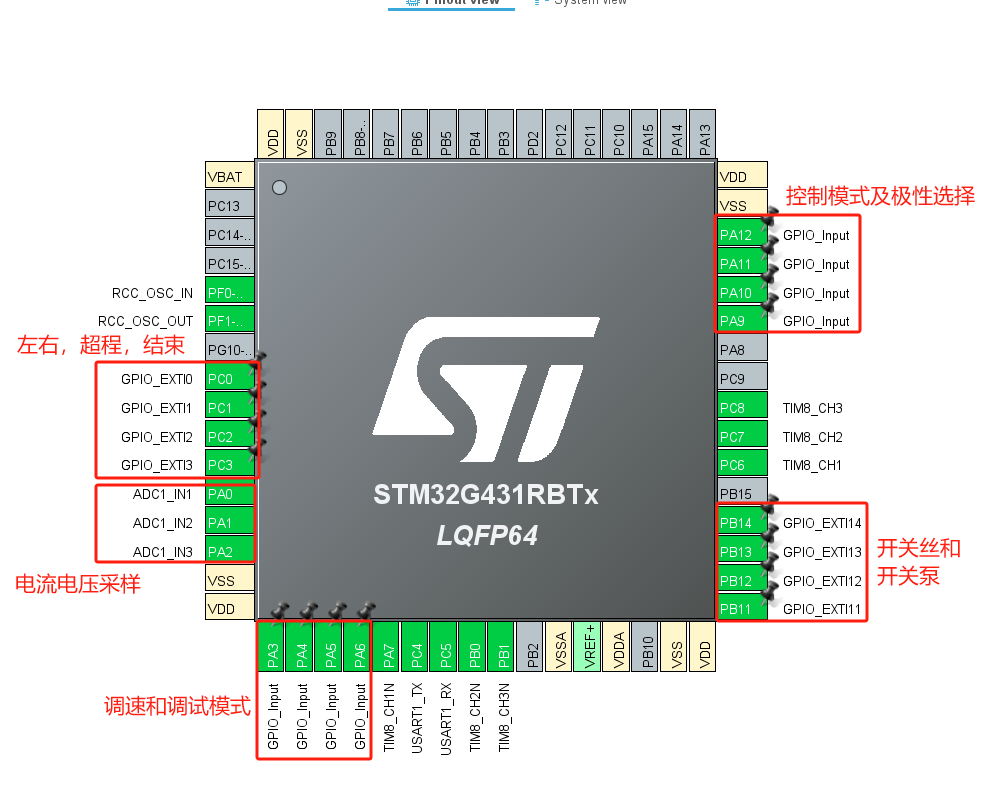
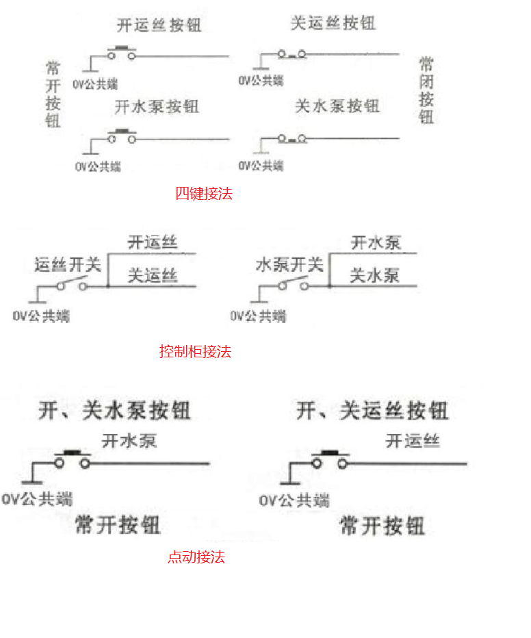

# VFD 变频器
中/快走丝线切割专用变频器，控制3相交流异步电机

## 基础配置
1. 主控芯片 **STM32G431RBT6**(128k flash and 32k ram)
2. 操作系统 **threadx 6.4.1**

## 基础框架
1. 采用事件驱动的微服务架构，每个业务均为一个服务(单独线程)，其他业务采用事件驱动的方式通信
2. 事件驱动链(待补充)

# NOTES
1. 第一次移植使用threadx，每个业务逻辑务必单独测试OK，否则逻辑太多，如果有BUG，不熟悉系统很难查找

2. 基于内存块，内存池，和消息队列实现的通信代码现场写的，没有经过实际项目验证，只是简单测试了下，是否可靠需要验证

3. 软件版本命名方式 **VA.B.C_250213**，其中：
    - A为主版本号，只在功能或者框架大变动时更新
    - B为次版本号，功能升级时更新
    - C为修订号，解决BUG时更新
    - 最后6位为固件编译打包时间

# 交流异步电机转速和电源频率的换算
1. n = 60f/p
2. **n**为转速，单位为rpm，**f** 为交流电源频率，单位为Hz，p为电机极对数

# 输入输出统计
1. 开关量输入信号，12个输入信号
    - 左右行程，超程(有效极性拨码开关控制，一般为常开NPN开关，有效极性为0)
    - 结束(有效极性拨码开关控制，一般为常开NPN开关，有效极性为0)
    - SP0~SP2(0~7速度调节)
    - 调试状态(0进入调试模式，无视断丝检测和加工结束，1无效)
    - 4键模式
        - 开运丝---常态为1(常开开关)，有效为0，实际配置为下降沿中断
        - 关运丝---常态为0(常闭开关)，有效为1，实际配置为上升沿中断
        - 开水泵---常态为1(常开开关)，有效为0，实际配置为下降沿中断
        - 关水泵---常态为0(常闭开关)，有效为1，实际配置为上升沿中断
    - 点动模式
        - 2个开关控制4个功能，触发一次为开运丝(开水泵)，再触发一次为1关运丝(关水泵)

2. 开关量输出信号，2个继电器输出信号
    - 开关高频
    - 水泵继电器输出220

3. ADC采样信号
    - 断丝检测电流采样
    - 电压检测采样

4. 实际接线图
    
 
 

# 下一步需测试内容
1. 电机刹车时关闭了定时器，输出了一个固定的ccr，测量在关闭定时器的情况下是否会按照该CCR输出实际的直流电压值